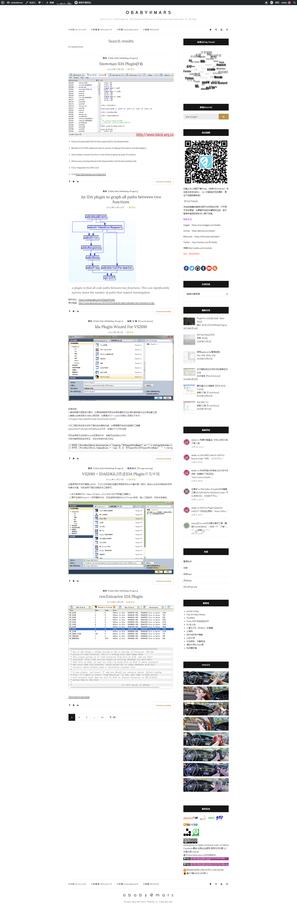
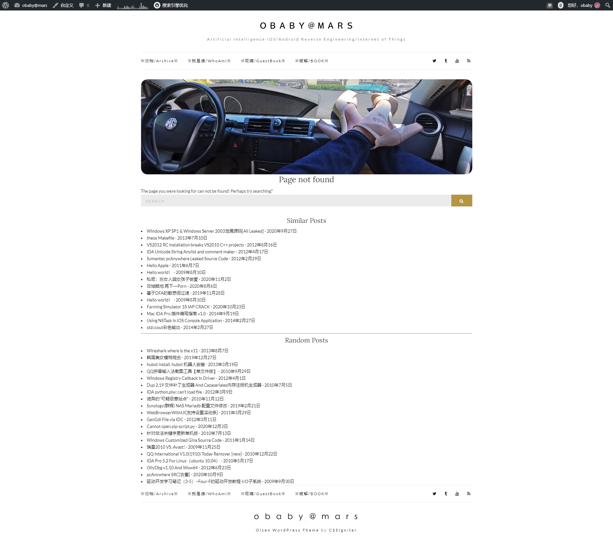
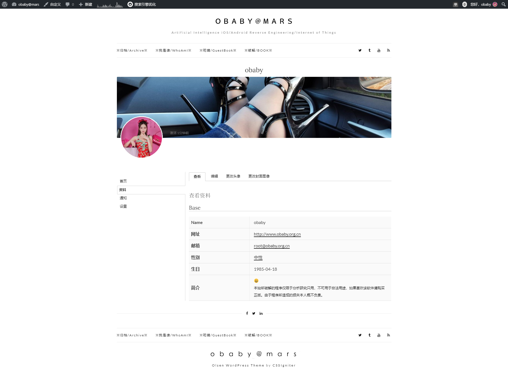

##Word Press 优化

1. 支持分词搜索  
通过jieba-php让wordpress支持分词搜索  
代码 functions.php  
[WordPress 中文分词搜索](http://h4ck.org.cn/2020/09/%E8%AE%A9wordpress%E6%94%AF%E6%8C%81%E5%88%86%E8%AF%8D%E6%90%9C%E7%B4%A2-wordpress-%E4%B8%AD%E6%96%87%E5%88%86%E8%AF%8D%E6%90%9C%E7%B4%A2/)  
  
2. 404页面支持url分词搜索  
代码 404.php  
[WordPress 优化404页面](http://h4ck.org.cn/2020/09/wordpress-%E4%BC%98%E5%8C%96404%E9%A1%B5%E9%9D%A2/)  
  
3. buddy press 去掉侧边栏  
代码 page.php  
[BuddyPress Theme Remove Sidebar](http://h4ck.org.cn/2020/09/buddypress-theme-remove-sidebar/)  
  

所有修改的文件都是主题下对应的文件！  

[obaby@mars](http://www.h4ck.org.cn)  
[http://www.obaby.org.cn](http://www.obaby.org.cn)  
[http://www.h4ck.org.cn](http://www.h4ck.org.cn)  
[http://findu.co](http://findu.co)  

